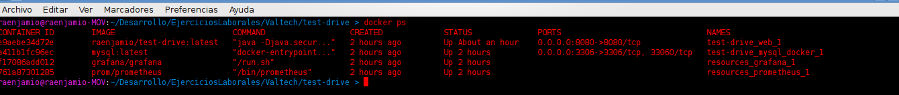
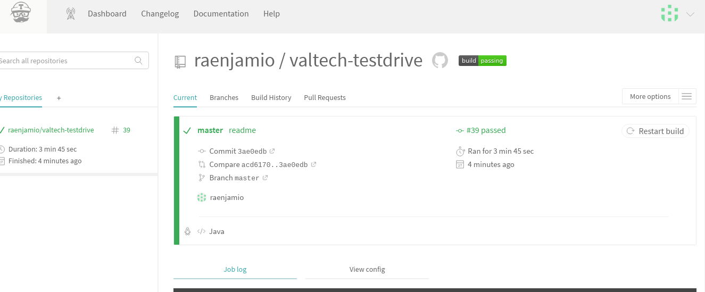
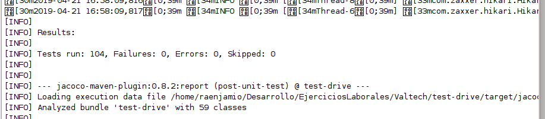
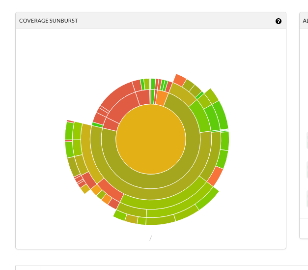
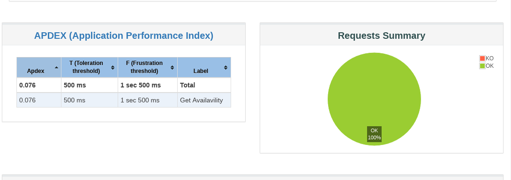
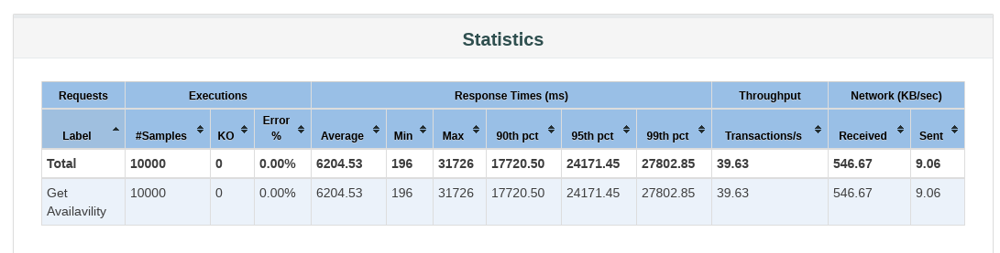
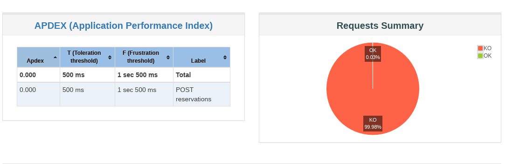
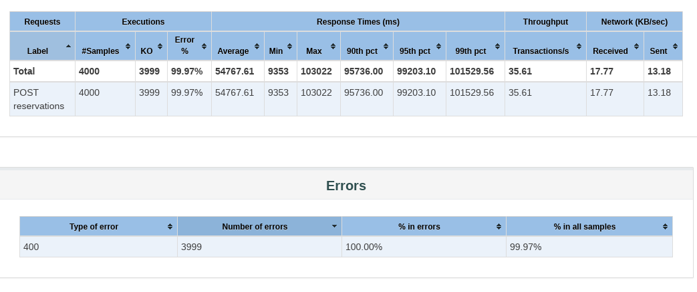
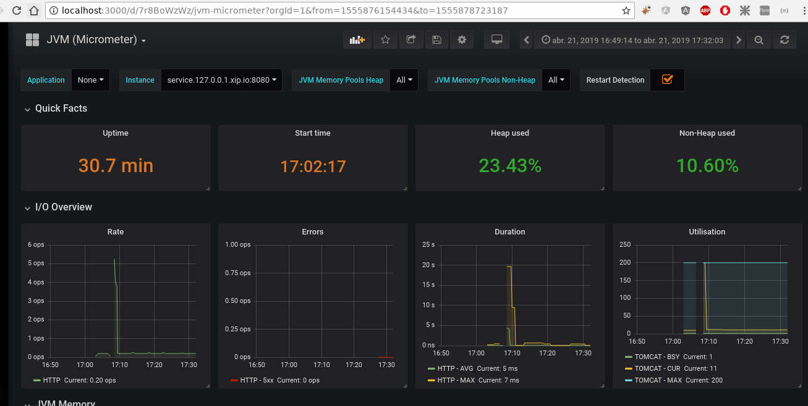

 

# TEST-DRIVE 
By Rodrigo Enjamio
Encargado por Valtech

POC de un sistema de reservas de test-drive de autos, solicitado por la empresa Valtech

# Tecnologias Utilizadas:
- Java8: El core de la app
- SpringBoot: Api para dar manejo de aplicacion Rest
- H2: BD embebida para profile desa
- MySQL: Para el profile prod
- Log-back: Logueo
- jUnit, mokito, hamcrest: Testing
- Lombok: Para no declarar setters, getters etc
- Maven: Gestion del proyecto
- Swagger: Documentador de API endpoints.
- Jacoco: Cobertura y reportes
- Docker-compose: Generar los contenedores para prod
- Map-struct: Para mappear un DTO a un Entity de forma rapida, el mas performante del mercado
- Spring-security: Mediante auth basic (user="user", pass="user") le damos una seguridad basica a la aplicacion
- Prometheus y Grafana: Monitoreo de la aplicacion
- Travis: Integracion continua

# Instrucciones para lanzar la aplicacion en localhost
Una vez clonado ir a la carpeta test-drive y desde la consola

- Perfil dev (usa una BD h2)

    mvn spring-boot:run

- Perfil prod (debe haber una base mysql)
    mvn spring-boot:run -Dspring-boot.run.profiles=prod
    java -jar target/test-drive-0.0.1-SNAPSHOT.jar --spring.profiles.active=prod

- Acceder via explorador a:

    localhost:8080/actuator/health
    localhost:8080/swagger-ui.html

# Heroku (esta desplegada el branch heroku que funciona con una base de datos H2 embebida):

    https://raenjamio-test-drive.herokuapp.com/actuator/health

# Levantar la aplicación con docker (creo una instancia de la aplicación y una de BD MySQL):
- En la carpeta  carpeta test-drive:
    mvn clean install (para generar la imagen)
    docker-compose up
    
 

# Levantar Grafana y prometheus:
- En la carpeta src/main/resources
    docker-compose up

# Tests
- Conexión con Travis y codecov	 que ejecuta los tests y se puede ver en el Badge, Cantidad de tests:

# Test de concurrencia jmeter:

    GET a /api/v1/cars/1/available : 10000 Request cada 1 segundo, sin errores.

# Concurrencia para hacer reservas de autos:
4000 request cada 1 segundo: hubo 3999 errores 400 por la excepción que se produce al validar si la reserva existe

A partir de los 5000 request empieza a haber problemas de infraestructura por concurrencia. Habría que aumentar la cantidad máxima de hilos del pool de la base de datos, poner mas memoria ram etc.

# Monitorización
- Prometheus y Grafana

user y pass de Grafana (admin, admin)
Dashboard id = 4701

- Para mas informacion ver documento Evidencias test-drive.docx

